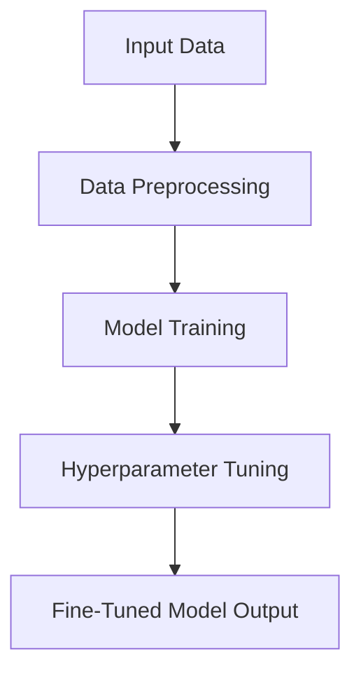
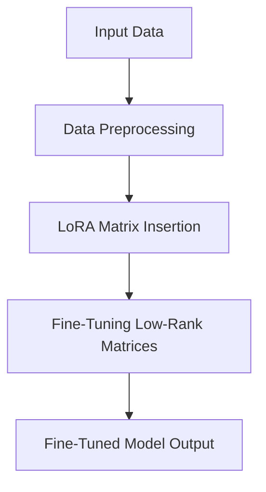
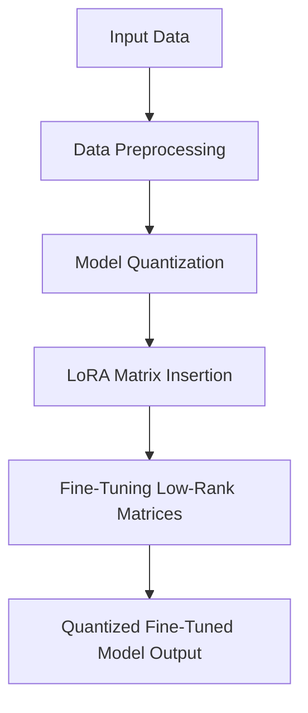

# 🦙 Fine-Tuning LLaMA 3.2 (1B) with Traditional, LoRA, and QLoRA Approaches

Welcome! This repository offers streamlined workflows and implementations for fine-tuning Meta's LLaMA 3.2 (1B) model. Here, we explore three fine-tuning techniques: **Traditional**, **LoRA** (Low-Rank Adaptation), and **QLoRA** (Quantized LoRA), each catering to different needs and resource constraints.

---

## 📌 Overview

1. **Traditional Fine-Tuning**  
   A comprehensive adjustment of the entire model, adjusting all layers for maximum customization at the cost of higher computational load and memory.
2. **LoRA (Low-Rank Adaptation)**  
   A more efficient technique that only modifies low-rank matrices within certain layers, conserving memory and accelerating the fine-tuning process without sacrificing much accuracy.
3. **QLoRA (Quantized LoRA)**  [](https://colab.research.google.com/drive/1K94mh-gPoXaCukgthPfNDa3ZgIr-qGZP?usp=sharing)
   A hybrid of quantization and LoRA, this technique achieves lower memory usage and faster processing by quantizing the model while applying low-rank adaptations. Ideal for resource-constrained environments.

---

## 🔄 Workflow

### Traditional Fine-Tuning

Fine-tunes every parameter in the model, often yielding highly customized outputs.



### LoRA Fine-Tuning

Only fine-tunes low-rank matrices, reducing memory usage and training time.



### QLoRA Fine-Tuning

Combines quantization with LoRA's efficient low-rank adaptation.



## 🚀 Getting Started

Each method has specific resource needs, so select the one that best fits your setup:

- Traditional: High compute requirements, ideal for environments where accuracy is paramount.
- LoRA: Balanced approach for moderate compute environments.
- QLoRA: Optimized for minimal compute environments, making it a top choice for deployment on resource-constrained devices.

## 🛠️ Key Features

- **Memory Efficiency**: LoRA and QLoRA significantly cut memory usage.
- **Speed**: LoRA and QLoRA enable faster fine-tuning cycles.
- **Flexibility**: Choose the technique that aligns with your resource availability and model needs.

## 📈 Results

Our experiments show the following trade-offs among the methods:

| Method      | Memory Usage | Training Speed | Fine-Tuning Flexibility | Model Accuracy |
|-------------|--------------|----------------|------------------------|----------------|
| Traditional | High         | Slow           | Full Model Tuning      | ⭐⭐⭐⭐⭐      |
| LoRA        | Moderate     | Fast           | Low-Rank Tuning Only   | ⭐⭐⭐⭐      |
| QLoRA       | Low          | Fastest        | Low-Rank + Quantization| ⭐⭐⭐       |

## 🤝 Contributing

We welcome contributions! Please feel free to submit issues, open pull requests, or reach out with any questions.

## 📄 License

This repository is licensed under the MIT License. See `LICENSE` for more information.

Happy fine-tuning! 🚀
```
